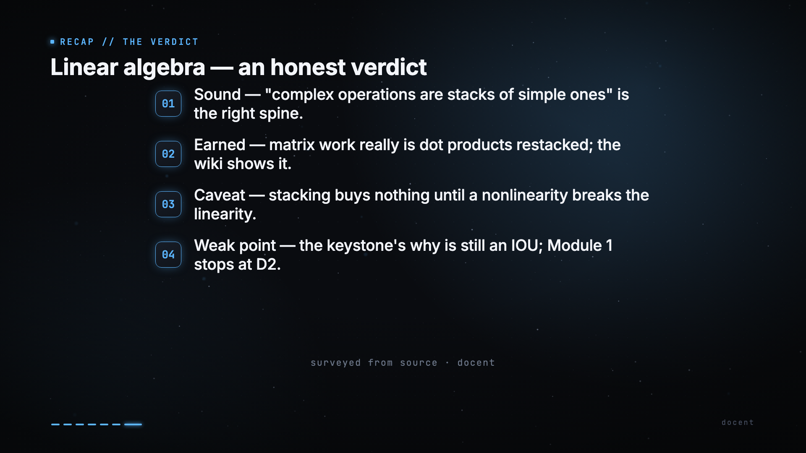
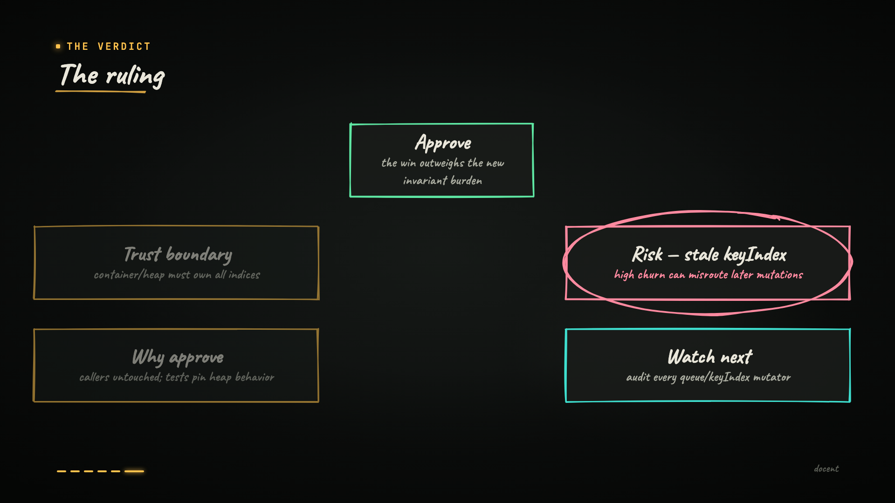
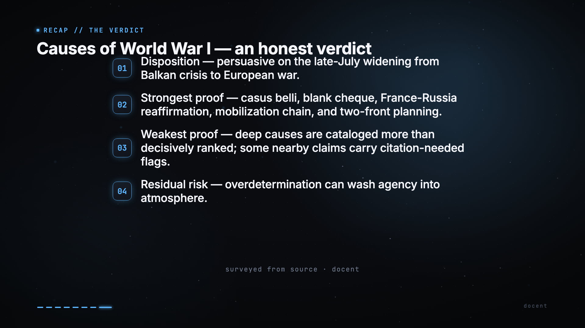
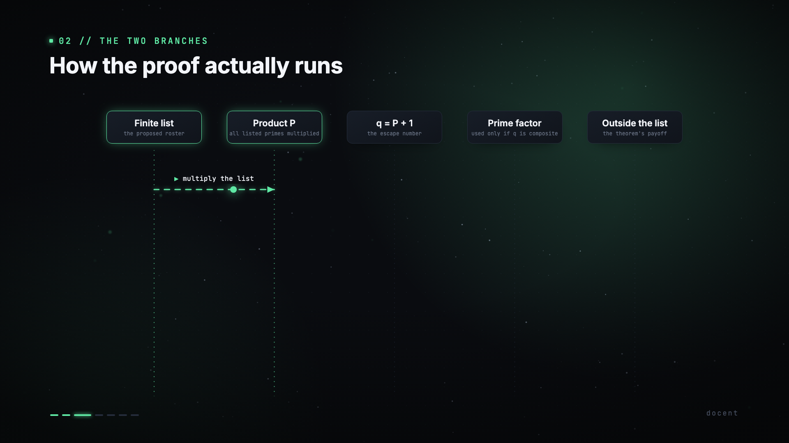
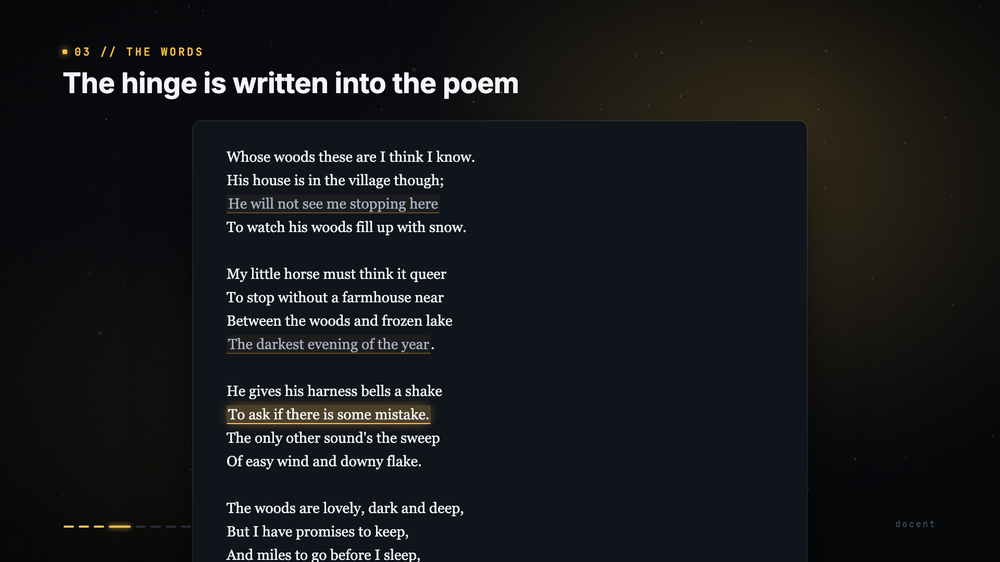

# docent

**An explanation engine.** Point it at a codebase, a pull request, a book, an
essay, a wiki, a URL — *any subject* — and it produces a narrated, animated
film that **interrogates** the subject, not a tour that admires it.

It is not a slide tool. It is not a screen recorder. It is a closed *grammar
of explanation* a coding agent renders any idea into, with a deterministic
engine that owns every pixel, and a quality cycle that raises its own floor
every time a film is judged.

---

## What it does

docent runs in three modes:

- **PR review** — `docent survey <repo> --mode pr --pr <n>`.
  A pull request reviewed the way a principal engineer would: triage what's
  load-bearing, name the trade-off, render a verdict. Built for the sprawling
  AI-agent PR no human reads.
- **Architecture review** — `docent survey <repo> --mode ar [--subsystem X]`.
  A whole system, or one subsystem, at depth — components, flow, failure
  modes, trade-offs.
- **Explainer** — `docent survey <subject> --mode ex`.
  Any non-code subject: a book, an essay, a wiki directory, a single file, a
  URL. Interrogates the *idea* — where it is counterintuitive, what
  misconception it must kill, where it breaks.

## A grammar of explanation, not of software

A film is a JSON spec. The engine renders a closed grammar of **fifteen scene
types** — the cognitive moves any subject is made of:

`frame` · `structure` · `progression` · `walkthrough` · `compare` ·
`quantities` · `chart` · `probe` · `tension` · `closeup` · `passage` ·
`figure` · `demonstrate` · `recap` · `diff`

Plus **eight intent knobs** — semantic dials the author turns, the engine
interprets deterministically. Never a hex code, never a coordinate:

`register` · `pace` · `weight` · `shot` · `cut` · `cadence` · `palette` ·
`treatment`

Plus three motion primitives that go past "animated slides":

- **`tween`** — a value counts *up* to its result, not cuts to it.
- **`chart`** — data plotted on real axes: curves, growing bars, a point
  riding a curve.
- **`morph`** — a node *becomes* another representation. A vector morphs into
  a matrix; a box becomes a code window; one equation rewrites into the next.

## Quality is not a one-shot

Every spec is judged by an adversarial sub-agent along six dimensions:
**triage**, **where it could be wrong**, **do the tests prove it**, **the
numbers**, **the trade-off**, **the verdict adjudicates**. A failing film
enters the inner loop — `docent review <id>` runs `judge → revise → re-judge`,
bounded.

```
docent judge <id>      grade one film along six dimensions
docent review <id>     judge → revise → re-judge until pass or budget
docent flywheel        what is consistently falling short across the corpus
```

`docent flywheel` surfaces recurring weaknesses across every film judged.
Those observations distill back into the survey brief, raising the floor for
every future film. **docent gets better as it runs.**

## The cascade

```
survey   →  films/<id>.json       the spec — authored by an agent
tts      →  public/audio/<id>/*   Kokoro narration, parallel
clips    →  public/clips/<id>/*   optional Manim inserts
render   →  out/<id>.mp4          Remotion, frame-parallel
```

Each stage is cached; a beat whose narration has not changed is not
re-rendered. `docent doctor` verifies every step of the environment.

## Two packages

- **`@docent/engine`** — the Remotion render engine, the cascade pipeline,
  the `docent` CLI. The deterministic runtime.
- **`@docent/agent`** — the brief, survey templates, the depth-review judge.
  Shaped as an [APM](https://github.com/microsoft/apm) package so docent
  rides inside any coding agent (Claude Code, Codex, …).

## Quickstart

docent ships through [APM](https://github.com/microsoft/apm) — the agent
layer installs into your coding agent, the engine runs locally.

```bash
# 1. Install the docent agent into your coding agent (Claude Code, Codex, …)
apm install docent-agent

# 2. Set up the local engine (one-time)
git clone https://github.com/benelser/docent && cd docent
bun install
bun packages/engine/cli/docent.ts doctor    # verify the cascade

# 3. Render a sample film
bun packages/engine/cli/docent.ts build linear-algebra
```

You will need: `bun`, `ffmpeg`, Python with `kokoro` (TTS), and a coding agent
CLI (`claude` or `codex`) on `PATH`. `docent doctor` walks every check and
tells you what is missing.

## The sample films

Five example films exercise the grammar across five domains — math, software,
history, math proof, and literature. **All pass the depth-review judge.**

### `linear-algebra` — the dot product as the keystone operation, restacked

A close reading of one chapter of an applied-math wiki. **26/30 PASS.**



### `kubernetes-pr` — a PR review of the Kubernetes scheduler heap refactor

Climbed `18 → 26` through the inner loop. **26/30 PASS.**



### `wwi-causes` — the causes of WWI, with ranked causal edges

A non-code history film. Climbed `18 → 27`. **27/30 PASS.**




### `euclid-primes` — Euclid's proof, infinitely many primes

A short deductive proof, the engine's `entails` edges and `equation` nodes
exercised on a real subject. Climbed `20 → 23` through the inner loop. **23/30 PASS.**



### `stopping-by-woods` — a close reading of Robert Frost

The poem annotated by phrase, the critical-reception debate adjudicated. The
first film authored fresh under all four outer-loop distillations. **27/30 PASS, first try.**



Render any of them with `docent build <id>`.

## Status

Engineering: feature-complete. Quality cycle: operational, with a **5/5 PASS
corpus across 5 domains**. The brief has raised its own floor four times via
the outer-loop distillation; the inner loop iterates failing films to PASS;
the flywheel surfaces recurring weaknesses across the corpus.

License: MIT (see `LICENSE`). Distribution: [APM](https://github.com/microsoft/apm)
only — the agent layer installs into your coding agent; the engine runs locally.
