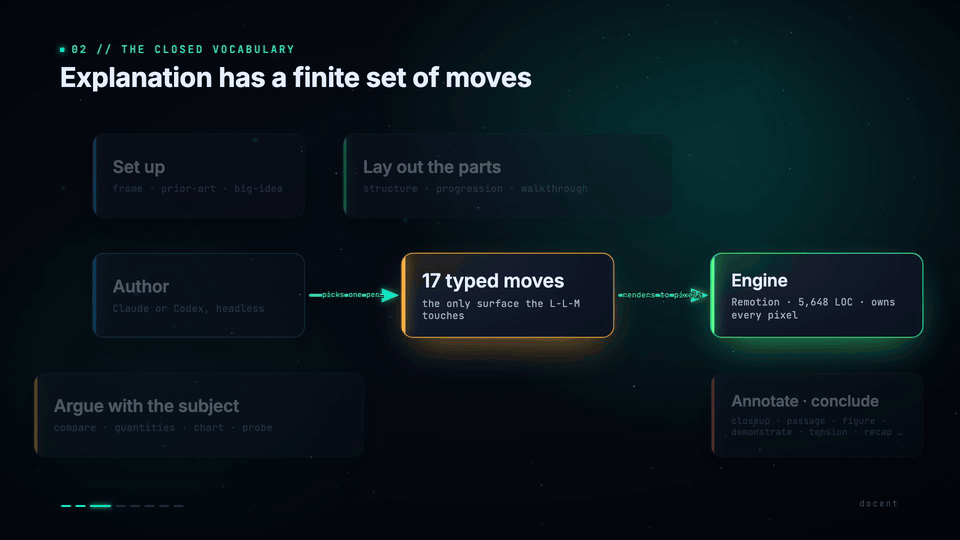
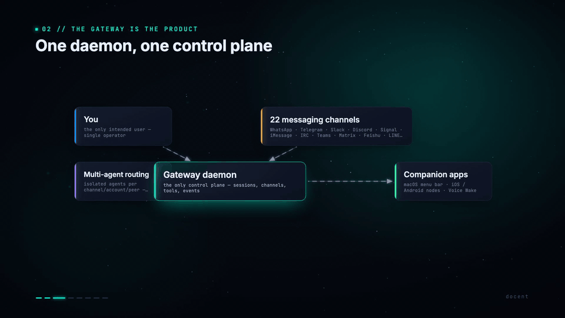
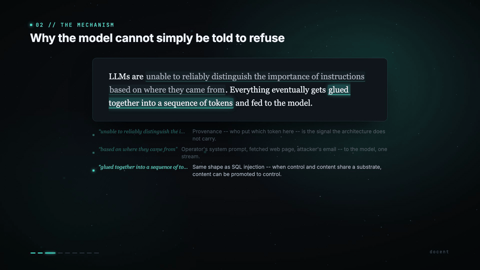

# docent

> **Point it at anything. Get back a narrated, animated film that argues for what it explains.**
>
> Codebases. Pull requests. Essays. Wiki articles. PDFs. arXiv papers. Any
> subject. Five minutes. A real film, not a tour.

[](https://github.com/benelser/docent/releases)
[](#what-it-can-actually-do)
[](#install)
[](LICENSE)

## Watch docent on four real subjects

Four films, four domains, four agent-authored cascades through the same
closed grammar. **No film below shares a template with any other** —
the agent picked the scenes, named the trade-off, committed to the
takeaway. The engine just rendered.

Hover for motion, click for the full HD mp4.

|  |  |
|---|---|
| [](https://github.com/benelser/docent/releases/download/v2.2.2/docent-self.mp4) | [](https://github.com/benelser/docent/releases/download/v2.2.2/openclaw-ar.mp4) |
| **▶ docent** *— reviewing its own architecture* — 11 min · 52 MB · [▶ play full HD](https://github.com/benelser/docent/releases/download/v2.2.2/docent-self.mp4)<br/>`frame · prior-art · structure · progression · compare · tension · quantities · recap` | **▶ OpenClaw** *— one local daemon, twenty-two channels* — 13 min · 83 MB · [▶ play full HD](https://github.com/benelser/docent/releases/download/v2.2.2/openclaw-ar.mp4)<br/>`frame · prior-art · structure · walkthrough · structure · tension · quantities · recap` |
| [](https://github.com/benelser/docent/releases/download/v2.2.2/lethal-trifecta-blog.mp4) | [](https://github.com/benelser/docent/releases/download/v2.2.2/arxiv-2512-14806.mp4) |
| **▶ The Lethal Trifecta** *— Simon Willison's essay on agent security* — 13 min · 68 MB · [▶ play full HD](https://github.com/benelser/docent/releases/download/v2.2.2/lethal-trifecta-blog.mp4)<br/>`frame · structure · passage · walkthrough · quantities · compare · tension · big-idea · recap` | **▶ Let the Barbarians In** *— a recent arXiv paper, fetched as PDF* — 11 min · 52 MB · [▶ play full HD](https://github.com/benelser/docent/releases/download/v2.2.2/arxiv-2512-14806.mp4)<br/>`frame · compare · structure · quantities · tension · probe · big-idea · recap` |

Each film went **survey → treatment → spec → judge → render** through
the same engine. The grammar is what's shared. The argument is what
each film commits to.

---

## Why "docent"?

A **docent** is the guide at a museum or gallery who walks you through the
exhibits. They don't just *describe* what's on the wall — they pick what's
worth your attention, explain the *why* behind each piece, name the
trade-off the artist made, and leave you with one idea to carry out the
door. They're authored. They argue. They commit.

That's the role the tool plays. A coding agent reads the subject end to
end, finds the load-bearing 5%, picks the angle, commits to a takeaway,
and walks you through it. Not a tour. A docent.

## The idea in 60 seconds

Most "explainer" tools either record a screen or arrange slides. docent does
neither. It treats explanation itself as a **closed grammar** — fifteen
scene types (`frame`, `structure`, `tension`, `big-idea`, `recap`, …), eight
intent knobs, three motion primitives — and gives a coding agent the brief
to render any idea into that grammar.

You hand it a subject. The agent surveys it, names what's load-bearing,
commits to a single takeaway, gets graded by an adversarial sub-agent
before it ships, and renders an HD MP4 that *argues* — not narrates.

The engine is deterministic and owns every pixel. The agent is the author.
The grammar is the contract between them.

## Try it — three commands

```bash
# 1. Install the agent layer into your coding host
apm install -t claude benelser/docent/packages/agent#v2.2.2
# OR for Codex:
codex plugin marketplace add github.com/benelser/docent
codex plugin add docent-agent@docent
```

```
# 2. Inside Claude Code (or Codex), first-run bootstrap:
/docent-doctor

# 3. Make a film about anything:
/docent-explain https://arxiv.org/abs/1706.03762
```

`/docent-doctor` clones the engine into `~/.local/share/docent/engine`,
installs the cascade (uv, ffmpeg, Python env, Kokoro voice weights,
Remotion), and puts the `docent` CLI on your PATH. You only run it once.

> **Only prerequisite is `bun`.** Don't have it? `curl -fsSL https://bun.sh/install | bash`, then `exec $SHELL -l`. docent's doctor handles the rest.

## The four skills

The slash commands match how you think about a subject:

| Command | What it does | Killer case |
|---|---|---|
| `/docent-doctor` | Verifies and installs the cascade. | First setup; whenever something feels broken. |
| `/docent-pr <repo> <pr#>` | PR-review film — load-bearing 5%, the trade-off, a verdict. | The 800-file AI-agent PR no human reads. |
| `/docent-ar <repo> [--subsystem X]` | Architecture review — components, flow, failure modes. | "How does X actually work?" — a system or one subsystem. |
| `/docent-explain <subject>` | The one-shot. Any subject, any mode, end-to-end. | When you just want a film. |

Each skill walks survey → treatment → spec → judge → render. The pause
points are where the **framing** forks, not where the engine does. The
engine never asks. It explains.

## What makes it different

**Closed grammar, not freeform animation.** A film is a JSON spec
against a 15-scene-type schema. The engine renders the spec
deterministically. Nothing the agent writes can produce a "weird CSS
moment" — the pixels are owned by Remotion code, not the agent.

**Mandatory adversarial judge on the happy path.** Every spec runs
through a seven-dimension grader (`triage`, `where-wrong`,
`tests-prove-it`, `the-numbers`, `the-trade-off`, `verdict-adjudicates`,
`takeaway-earned`) before render. A film the judge rejects does not
ship. The loop reliably lifts first-draft specs by ~7 points on a
30-point scale.

**The Big Idea is built into the grammar.** Every explainer film must
end on one held sentence the viewer should leave with — earned by the
scenes that came before, not asserted. The validator hard-fails any
explainer spec that lacks it.

**Self-healing install.** `/docent-doctor` knows how to install uv,
ffmpeg, Kokoro voice weights, and Remotion; pre-emptively flags Codex's
quirky plugin behaviors; retries transient agent failures so a flaky
network doesn't burn a 25-minute survey.

## What it can actually do

Five films across five domains. Every one passes the seven-dimension
depth contract. All authored by an agent driving the same closed grammar:

| Film | Subject | Domain | Verdict |
|---|---|---|---|
| `linear-algebra` | The dot product as the keystone operation | Math | 26 / 30 PASS |
| `kubernetes-pr` | The Kubernetes scheduler heap refactor | Software | 26 / 30 PASS |
| `euclid-primes` | Euclid's proof of infinitely many primes | Math proof | 23 / 30 PASS |
| `stopping-by-woods` | A close reading of Robert Frost | Literature | 27 / 30 PASS, first try |
| `grammar-check` | Kitchen-sink scene grammar test | Engineering | (test fixture) |

Specs live in `films/*.json`. Render any of them: `/docent-build <id>`,
or `docent build <id>` directly.

## How it works

The cascade runs in four cached stages:

```
survey   →  films/<id>.json       the spec — authored by the agent
tts      →  public/audio/<id>/*   Kokoro narration, parallel
clips    →  public/clips/<id>/*   optional Manim inserts
render   →  out/<id>.mp4          Remotion, frame-parallel
```

Every stage is cached on the beat. A beat whose narration text hasn't
changed isn't re-rendered or re-synthesised. The engine binary owns
every pixel; the agent only ever writes JSON.

## Updating

**Claude Code (APM):**

```bash
# pinned: bump the tag in apm.yml, then:
apm install

# unpinned (tracks main):
apm install --update benelser/docent/packages/agent
```

**Codex:**

```bash
# Git-source marketplace:
codex plugin marketplace upgrade docent

# Local-path marketplace (development):
codex plugin add docent-agent@docent
```

After the engine layer updates, re-run `/docent-doctor` to pick up any
new dependencies. The engine `git pull`s itself the next time the
cascade runs.

## License

MIT (see [`LICENSE`](LICENSE)). Distribution: APM
([benelser/docent/packages/agent](https://github.com/benelser/docent/tree/main/packages/agent))
for Claude Code, and the Codex plugin marketplace for Codex. The
engine itself is `private: true` — everything users need ships through
the agent layer.

---

> *"docent gets better as it runs."* The judge grades every film. The
> revise loop closes the gap. The outer flywheel distills recurring
> weaknesses back into the brief. Each generation raises the floor for
> the next.
